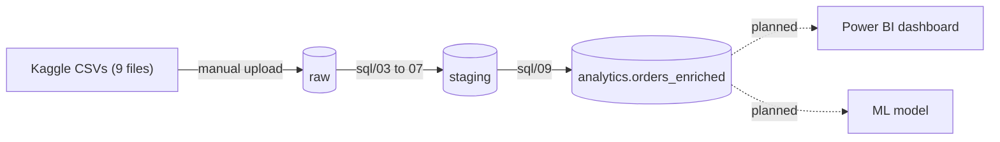

# Olist E-Commerce Analytics

An end-to-end SQL and machine learning project on the Olist Brazilian e-commerce dataset, built on Google BigQuery. The goal: turn nine messy relational tables into a clean, trustworthy, one-row-per-order table that supports business analysis and a prediction model.

**Status:** data engineering layer complete. Analytics dashboard and ML model in progress.

## Data

[Olist Brazilian E-Commerce Public Dataset](https://www.kaggle.com/datasets/olistbr/brazilian-ecommerce) from Kaggle: 9 CSV files, 99,441 orders. The raw CSVs are not stored in this repo; download them from Kaggle and load them into a `raw` dataset in BigQuery.

## Pipeline



All transformations are SQL scripts in `sql/`, numbered in run order.

## Rebuild

The project can be recreated from this repo plus the Kaggle download (requires a Google Cloud project with BigQuery and a local login via `gcloud auth application-default login`).

1. Download the [dataset](https://www.kaggle.com/datasets/olistbr/brazilian-ecommerce) from Kaggle and place the 9 CSV files in `data/`.
2. Run the pipeline:

```
pip install -r requirements.txt
python scripts/load_raw.py
python scripts/rebuild.py
```

`load_raw.py` loads the nine CSVs into the `raw` dataset. `rebuild.py` runs the staging and analytics SQL in order, then checks the final table against the verified totals (99,441 orders, 13,591,643.70 item revenue) and stops with an error if they don't match.

Note: `sql/00_setup.sql` creates the `raw`, `staging`, and `analytics` datasets and has to be run once before the first load. `sql/01a_raw_column_fixes.sql` is only needed for tables uploaded by hand through the BigQuery console.

## Data quality findings and decisions

| Finding | Decision |
|---|---|
| 8 delivered orders have no delivery date | Kept; flagged with `has_valid_delivery`; excluded from delivery-time metrics. Dates were not filled in. |
| 551 extra rows in `order_reviews` (547 orders have more than one review) | Averaged review scores to one row per order and kept `n_reviews`. |
| Joining items and payments directly inflated item revenue by about 4.5% (13.59M to 14.21M) | Summarized items and payments to one row per order before joining; joined revenue now matches the direct sum exactly. |
| 775 orders have no items (mostly unavailable or canceled) | Kept with `has_items = FALSE`. |
| 610 products have no category or photo count | Labeled `unknown`, left other fields NULL. |
| 2 categories missing from the translation table | Mapped by hand, with a comment in the SQL. |
| 1 delivered order has no payment record | Kept; flagged with `has_payment_record = FALSE`. |
| Delivery time is skewed (median 10 days, 95th percentile 29, max 210) | Report median and percentiles instead of the mean. |

## Roadmap

- [x] Raw load, profiling, staging, analytics table
- [ ] SQL analysis: revenue trends, cohort retention, delivery and seller performance
- [ ] Power BI dashboard
- [ ] ML model (prediction target to be decided) with baseline comparison
- [x] One-command rebuild script